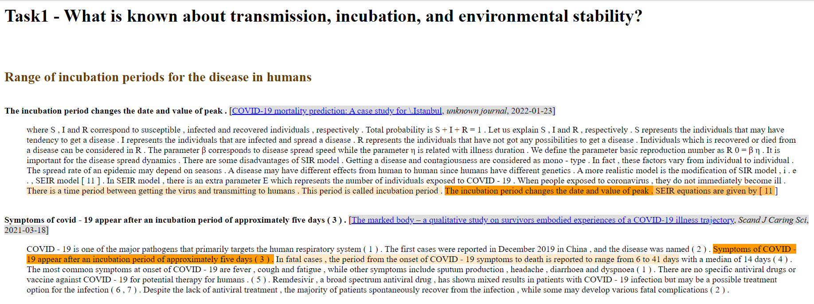
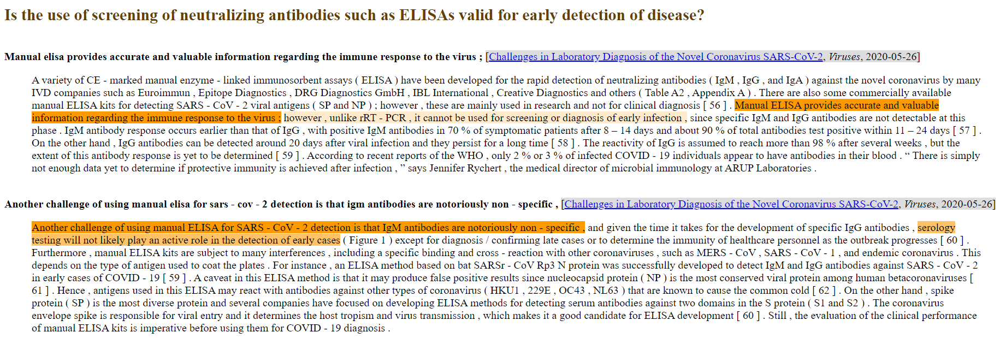

# QA-model

This algorithm is based on the system created by Jon Ander Campos, Eneko Agirre, Aitor Soroa and Arantxa Otegi: [Neural Question Answering for CORD19 (task8)
](https://www.kaggle.com/code/aotegi/neural-question-answering-for-cord19-task8)

## Summary

During the time of COVID pandemic, many articles were published daily, and researchers had no time to read each of them. That's why The White House and other organizations uploaded a database to Kaggle's platform with scientific articles of this virus. The aim was to create a system capable of extracting information from a data base and answering questions passed as a parameter. My proposal was to create that model. For this purpose, we shall first make a Fine-tuning of a pre-trained language model BERT and then use it in a Retrieal Reader sistem for the purpose of answering questions about COVID.

## Instructions

1. Download the [pytorch model](https://drive.google.com/file/d/1FEbTH5C0hfsHrjn-76_T8igpY4UGUFFC/view?usp=sharing) and save it in BERT folder.
2. Install the required packages.
3. Donwload the [CORD-19](https://www.kaggle.com/datasets/allen-institute-for-ai/CORD-19-research-challenge) dataset.

Another option is to upload the notebook in the Kaggle platform and save the databases in that reposittory.

## Some Outputs

